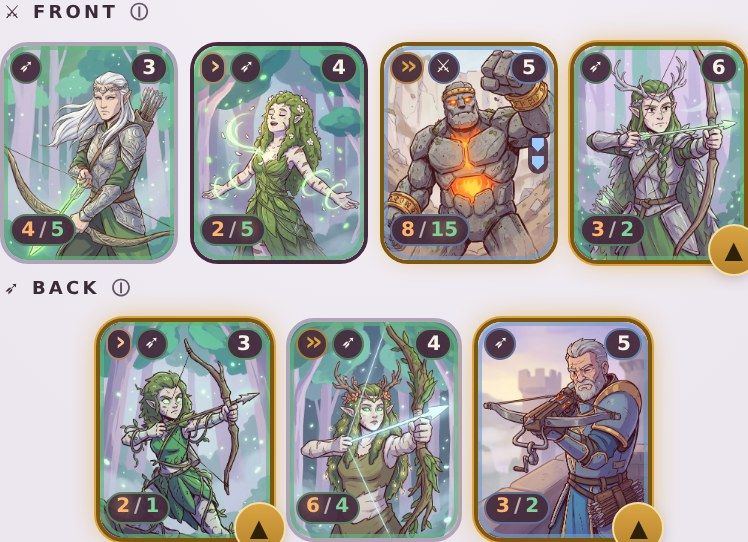
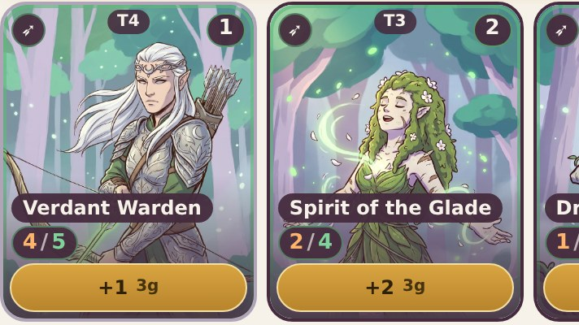
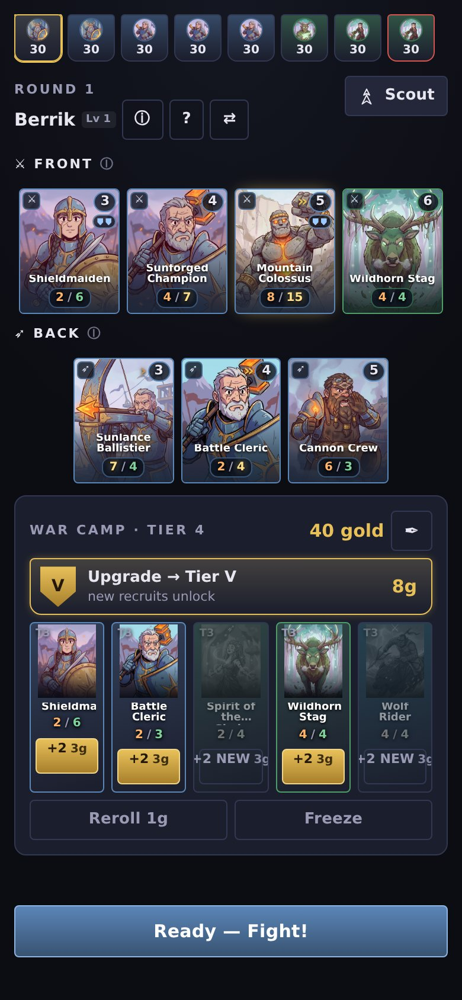
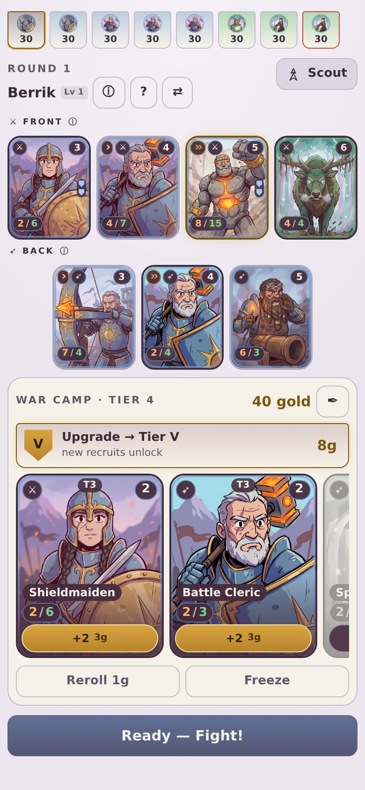
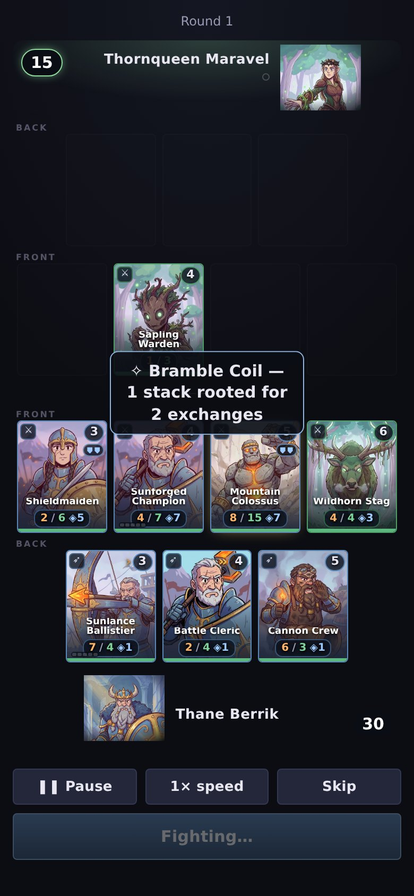
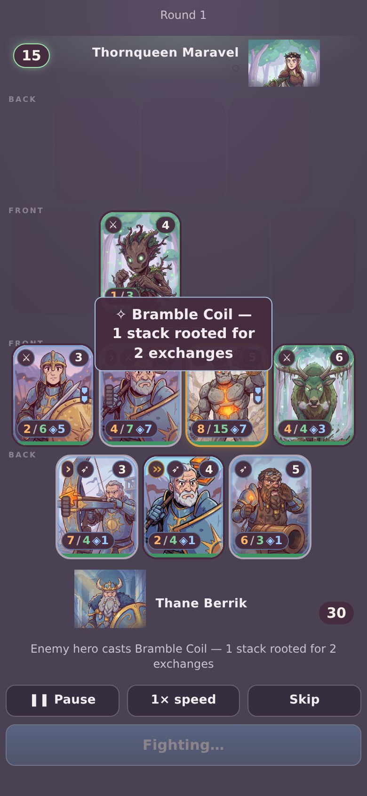
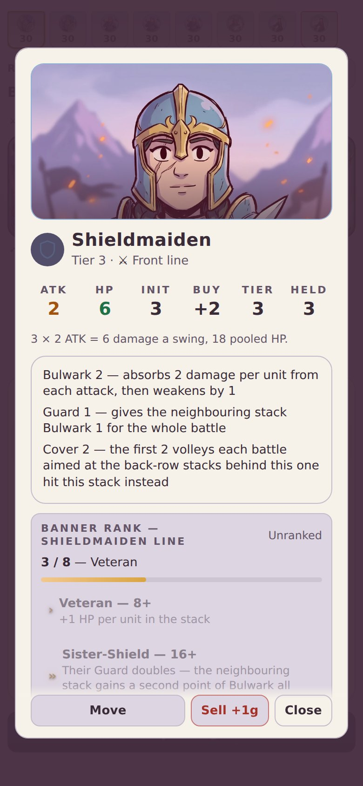
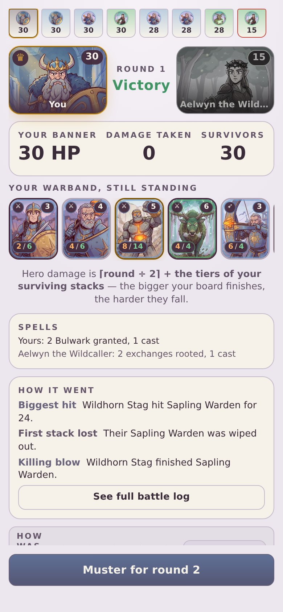

# Design Notes 07 — acceptance evidence

> **The screenshots below show the Daybreak light theme, which was tried in
> play and reverted.** The app is dark again — warm plum-dark, per
> PLAN_ART_AND_THEME §4. Everything else here still holds: the layout
> measurements, the card anatomy and the contrast method are unchanged by the
> ground moving, which was the point of building the theme as tokens. The
> contrast figures were re-run on the dark ground and still come back at zero
> failing on every screen.

Everything below was measured in a headless Chromium against the built app, not
estimated. "Before" is `5dcd124` (the v2 art restored, the old UI) served from a
second worktree so the two are compared on identical content: the same seeded
run, the same board, the same round.

## §6.1 — layout at 390×844

| | board card | hand card | hand visible | Muster scrolls? |
|---|---|---|---|---|
| **required** | ≥ 86px, 8 slots | ≥ 150px | 2.5 | no |
| **measured** | **89px** | **158px** | **2.29** | **no** |

Eight slots fit at that width without shrinking: every cell has always been
sized as a quarter of its row, so DN06's fourth back slot changes the back
line's card count, not its card size.

2.29 cards visible rather than 2.5 is a geometric ceiling, not a shortfall:
2.5 × 150px plus gaps is 391px on a 390pt screen, so "2.5 visible at ≥150px"
cannot both hold. The card floor won; the third card still peeks, which is what
the peek is for.

Across every size measured — no page scroll anywhere, which the old layout
could not manage below 390pt:

| viewport | board card | hand card | overflow | before |
|---|---|---|---|---|
| 320×568 | 38px | 62px | 0 | 38px, **76px over** |
| 360×640 | 40px | 96px | 0 | 44px, **37px over** |
| 375×667 | 46px | 104px | 0 | 49px, **29px over** |
| 390×844 | 89px | 158px | 0 | 85px, 0 |
| 412×915 | 95px | 180px | 0 | 93px, 0 |

Battle, same treatment (it has four card rows and two hero stages, so it is the
tighter screen — see the commit for why §3's "one size up" does not survive the
arithmetic at 390pt):

| viewport | battle card | overflow | before |
|---|---|---|---|
| 320×568 | 36px | 0 | 38px, **24px over** (clipped its own action bar) |
| 360×640 | 50px | 0 | 44px, 0 |
| 375×667 | 55px | 0 | 49px, 0 |
| 390×844 | 88px | 0 | 85px, **2px over** |
| 412×915 | 94px | 0 | 93px, 0 |

## §6.2 — artwork by area, Muster

Measured as the union of every `.plate` box actually on screen, clipped to the
viewport, over the app's own area.

| | artwork px | screen px | share |
|---|---|---|---|
| before | 78,613 | 329,160 | **23.9%** |
| after | 134,828 | 329,160 | **41.0%** |

**Short of §6.2's 60%, and I do not believe 60% is reachable on this screen.**
Muster still carries a ladder, a hero header, the tier-up banner, a gold
counter, Reroll/Freeze and a pinned Fight button; those come to roughly 35% of
the viewport before a card is drawn, and the board plus the hand come to about
54% when every slot is full. Getting past 60% means deleting controls, not
tightening layout. The number here is the honest one rather than a flattering
measurement — §6.2's own baseline figure ("under 15%") matches what this method
reports for the old UI on smaller phones (12.1% at 320×568, 12.7% at 360×640).

Battle: 25.3% → 26.2% at 390×844. Small, because this seed's opponent has one
stack left and empty slots stay rendered so nothing reflows mid-fight.

## §6.4 — legibility of card chrome

Verified by pixel sampling, not by eye. For each screen the page is shot twice
— once normally, once with every text colour forced transparent — so the second
shot gives the exact ground under each label, gradients, scrims and painted
plates included. Each label is then scored against it at WCAG AA (4.5:1, or
3:1 for large text).

| screen | failing |
|---|---|
| home (dawn) | 0 |
| muster (dawn) | 0 |
| inspect (dawn) | 0 |
| recap (dawn) | 0 |
| battle (dusk) | 0 |

And the specific §6.4 case — stat pills, count badges and rank pips on the five
brightest plates in the set, ranked by mean luminance: `vd_warden` (.381),
`vd_glade` (.350), `vd_dryad` (.339), `vd_moonshade` (.339), `vg_colossus`
(.338). Board and hand cards, both grounds: **0 failing**.

That holds by construction rather than by luck: everything drawn on a plate
sits on `--veil`, so its contrast is against the ink backing and not against
the page or the painting.

Board and hand at those five plates, close up:

## §6.5 — no black pixels in the chrome

`styles.css` contains no colour literal outside its two theme blocks (`:root`
and `body[data-ground='dusk']`), and the components contain none at all —
`unitColor()` and `branchColor()` return `var()` references, since their values
are only ever assigned to a custom property. Every former `#000` shadow now
resolves through `--shadow-ink`, which is the art's maroon at 35%.

## §6.6 — lazy loading and the pre-cache decision

A fresh Muster fetches **16** plates, not 41. Of the 20 `` on
the page, **9** carry `loading="lazy"`; **0** sigil fallbacks render.

The `sw.js` pre-cache decision from PLAN_ART_AND_THEME stands and is unchanged
by this work: the plate list is handed to the worker on idle via `warm-art`,
never in `install`, so ~9 MB of art cannot block first paint — and
`warmArtCache()` skips the warm entirely on Save-Data or 2G connections. Those
devices still play; they fetch each plate on first use. `CACHE` was bumped to
`v7` with the art restore, because the filenames did not change and every
installed PWA would otherwise keep serving the reverted plates forever.

## §6.7 — screenshots at 390px

| | before | after |
|---|---|---|
| Muster |  |  |
| Battle |  |  |

Inspect and Recap (Daybreak):

| Inspect | Recap |
|---|---|
|  |  |

Both grounds are represented: Muster, Inspect and Recap are dawn; Battle is
dusk.
